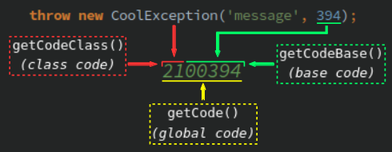

# GlobalException

Contents:
- [Problem](#problem)
- [Solution](#solution)
- [How it works](#how-it-works)
- [Setup](#setup)
    - [Overview example script](#overview-example-script)
- [Codes validation](#codes-validation)

## Problem

A web application _CoolApp_ has its own API. That API has a function; let's call it... `foo()`. That `foo()` function
has some complicated business logic and can throw different exceptions. Some of those exceptions are:
- **230** => _Not enough money._
- **525** => _Internal temporary error. Please try again 5 seconds later._

When _CoolApp_'s API client _unfortunate_robot_ (you'll understand very soon why it is so unfortunate) calls `foo()`
it expects those exceptions and is ready to parse and process them by codes (not a big deal). When it catches **230**
it informs a user that some money should be added to a wallet for completing the process successfully. And when that
_unfortunate_robot_ catches **525** it just sleeps for 5 seconds and then calls `foo()` again (with no tries limit;
yes, it's is not a very good practice but is suitable for the problem illustration).

SUDDENLY _CoolApp_'s owner makes a deal with _OddApp_'s owner to operate together for some mutual benefits. One of the
deal's part is that `foo()` business logic includes now a request to _OddApp_ API for some extra processing.

So one unfortunate day our already well known _unfortunate_robot_ calls `foo()` and gets the **525** exception...
The problem is that this time the **525** exception is thrown by _OddApp_'s functionality and means something very
different - "_Out of stock_". Such an exception occurs every time this poor robot calls `foo()`, catches **525**,
sleeps 5 seconds, tries again... Until a product is in a stock again. And there is more: _CoolApp_ still keeps its
own **525** - "_Internal temporary error_" exception may appear as well.

So that _unfortunate_robot_ just can't determine the nature of that **525** now. The robot's developer must notice
the endless loop problem and reprogram the robot to parse not a code but a message (or just to add the tries limit).
As you probably know such a practice is not a very reliable one. On the other side _CoolApp_ could handle _OddApp_
exception to transform it to _CoolApp_ exception with the same meaning and a new code **600**. But such a thing must
be done for each new _OddApp_ exception and a new code uniqueness must be guaranteed somehow by _CoolApp_.

Of course there are other possible solutions for such a problem and there might be other inconveniences caused by
possible exceptions codes duplicates. But we wanted something universal that could handle many different problems by
one common and more automated strategy... And here comes **GlobalException**.

## Solution

It would be great if _CoolApp_ could transform both own and _OldApp_ exceptions codes **525** (фтв others) into unique
ones automatically. If done so then _unfortunate_robot_ becomes _lucky_robot_ because it can differ those codes easily
without any hacks! The only thing the robot's developer needs is specifying both new unique codes for the exceptions
individual post-processing.

So how exactly **GlobalException** can do such a trick easily and mostly automated?

## How it works



The exceptions' codes globalization mechanism is based on a simple math calculation involving mainly these two
integers:
- _Base code_ - it is specified as an initial exception code: you pass it as the second parameter to an exception
constructor.
- _Class code_ - that's the integer which transforms _base codes_ into _global_ ones becoming their "higher" part.
It is configured in an exception class config.

For instance **GlobalException** can create an exception with its code **45600123** based on the _base code_ **123**
and the _class code_ **456**.

In most cases that is enough to have all your app exceptions codes unique. But sometimes you can not afford so small
(or large) _base codes_. Such a case is described in the
[_experienced_ section](../experienced/global-exception.md#inappropriate-base-code-maximum).

## Setup

Let's imagine, you have an exception class called `UserException`. You can throw some exceptions of this class with
different codes. For instance you can throw an exception "_No money - no honey!_" with the code **5**. And you want
this code (and other `UserException` codes) become _global_...

1. Create an abstract exception class (for instance let it be `AppException`) for all your application exceptions.
It must extend **GlobalException**.
1. Inside the class define the constant array `CLASS_CODE_LIST` with `UserException` qualified namespaced class name
as its element key and a _class code_ as the element value:

    ```php
    use MagicPush\EnterpriseException\GlobalException;
    
    abstract class AppException extends GlobalException
    {
        const CLASS_CODE_LIST = [
            UserException::class => 42,
        ];
    }
    ```

1. Extend `UserException` from `AppException` (or whatever name you give your base exception class).
1. Create `UserException` objects as usual: _global codes_ will be calculated automaticaly!

    ```php
    $e = new UserException('No money - no honey!', 5);
    echo $e->getCode();      // >> 4200005
    echo $e->getCodeBase();  // >> 5
    echo $e::getCodeClass(); // >> 42
    ```

That's it! From this point every `UserException` construction with _base codes_ from **1** to **99999** will create
exceptions with _global codes_ from **4200001** to **4299999**. Add more exception classes to `CLASS_CODE_LIST`,
specify unique _class codes_ for each and all those classes will generate exceptions with unique codes!

For manual _global codes_ calculation you can call `getCodeGlobal()` static method directly:

```php
echo UserException::getCodeGlobal(123); // >> 4200123
```

Defining an abstract base exception class is not obligatory but there are reasons for it:
- You can define `CLASS_CODE_LIST` inside `UserException` and that will work perfectly. But it is more convenient to
control your exceptions _class codes_ by specifying all of them in one place.
- You will definitely need a base exception class with the common _class codes_ list if you wish to use
[Parser](parser.md#prerequisites).

### Overview example script

The repository contains an example script with a few classes configured. Just launch it in a CLI:

```php
php examples/global.php
```

## Codes validation

Every _class code_ and _base code_ are validated during a _global code_ calculation. If any of the codes is
considered invalid then a _base code_ is considered the only exception code and the globalization feature is disabled
for that exception. You must consider these limits to keep your codes valid:
- A _base code_ must be positive and less than **100000**.
    - Read the _experienced_ section if you want to
    [alter the maximum](../experienced/global-exception.md#inappropriate-base-code-maximum).
- A _class code_ must be positive and less than the value returned by `getCodeClassMax()`.
    - Read the _experienced_ section if you want to
    [decrease the maximum](../experienced/global-exception.md#global-code-application-limit).

## Further reading

- [CustomizableException](customizable-exception.md)
- [Parser](parser.md)
- [Mastering GlobalException](../experienced/global-exception.md)
