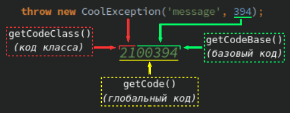

# GlobalException

(исходник: [src/GlobalException.php](../../../../src/GlobalException.php))

Содержание:
- [Проблема](#проблема)
- [Решение](#решение)
- [Как это работает](#как-это-работает)
- [Настройка](#настройка)
    - [Демонстрационный скрипт](#демонстрационный-скрипт)
- [Валидация кодов](#валидация-кодов)

## Проблема

У веб-приложения _CoolApp_ есть собственный API. В этом API зарегистрирована функция; назовём её, допустим... `foo()`.
Эта функция `foo()` реализует некоторую сложную бизнес-логику и может выбрасывать разнообразные исключения. Вот вам
парочка из этих исключений:
- **230** => _Недостаточно средств._
- **525** => _Внутренняя временная ошибка. Пожалуйста, попробуйте снова через 5 секунд._

Когда один из клиентов API приложения _CoolApp_, _несчастный\_робот_ (вскоре вы поймёте, отчего он так несчастлив)
вызывает `foo()`, этот робот ожидает эти исключения и уже готов разобрать и обработать их, ориентируясь на их коды
(обычное дело). Когда он перехватывает **230**, он сообщает пользователю что надо бы деньжат закинуть на кошелёк,
если пользователь хочет успешно завершить интересующий его процесс. А когда этот _несчастный\_робот_ перехватывает
**525**, он просто ждём 5 секунд, а затем снова вызывает `foo()` (без ограничения на количество попыток; да, так
делать не очень хорошо, но такой пример как раз замечательно подходит для яркой иллюстрации описываемой проблемы).

ВНЕЗАПНО владелец _CoolApp_ совершает сделку с владельцем _OddApp_ ради взаимовыгодного сотрудничества. Одна из частей
сделки состоит в том, что бизнес-логика функции `foo()` должна теперь включать в себя запрос к API _OddApp_ для
некоторой дополнительной обработки.

Итак, в один неудачный день уже хорошо известный нам _несчастный\_робот_ вызывает `foo()` и ловит исключение **525**...
Закавыка в том, что на этот раз исключение **525** выброшено функционалом _OddApp_ и означает нечто совсем иное -
"_Нет на складе_". Это исключение, ествественно, возникает каждый раз, когда бедный робот вызывает `foo()`, ловит
**525**, ждёт 5 секунд, пробует снова... И так до тех пор, пока нужный товар не поступит на склад. Более того:
_CoolApp_ всё так же может выбросить своё собственное исключение **525**, означающее "_внутреннюю временную ошибку_".

Таким образом, _несчастный\_робот_ ныне не в состоянии определить природу исключения **525**. Разработчик этого робота
должен обнаружить бесконченый цикл попыток и переписать робота так, чтобы тот разбирал уже не код, а само сообщение
об ошибке (ну или хотя бы учитывал ограничение на количество попыток повторного запроса). Как вы уже, наверное, сами
поняли, такое решение будет не очень надёжным. С другой стороны, приложение _CoolApp_ могло бы самостоятельно
обрабатывать это исключение _OddApp_, превращая его в собственное с таким же сообщением, но с новым кодом **600**.
Однако, такой подход нужно будет применять для каждого нового исключения _OddApp_, и нужно будет как-то гарантировать
уникальность всех этих новых кодов на уровне _CoolApp_.

Конечно же, могут быть и какие-либо другие решения данной проблемы, а также неудобства, касающиеся возможного
возникновения дубликатов кодов исключений. Мы же хотели иметь что-нибудь универсальное, способное решать разные
проблемы такого рода с помощью некоторой единой стратегии, поддающейся автоматизации... И тут на сцену выходит
**GlobalException**.

## Решение

Было бы здорово, если бы _CoolApp_ могло автоматичечки трансформировать коды исключения **525** (и других исключений)
как собственного, так и выбрасываемого _OldApp_ в уникальные. В таком случае _несчастный\_робот_ стал бы
_счастливым\_роботом_, ибо тогда он бы смог с лёгкостью отличить эти исключения без каких-либо костылей! Единственное,
что оставалось бы разработчику робота - это учесть новые уникальные коды для их соответствующих индивидуальных
обработок.

Так как же именно **GlobalException** повзоляет автоматически выполнять подобный трюк?

## Как это работает



Механизм глобализации кодов исключений основан на простой математической операции, в которой принимают основное
участие следующие два целых числа:
- _Базовый код_ (_base code_) - задаётся в качестве изначального кода исключения: вы передаёте этот код в качестве
второго параметра конструктора исключения.
- _Код класса_ (_class code_) - это то самое целое число, которые превращает _базовые коды_ в _глобальные_, становясь
их старшими разрядами. Этот код задаётся в конфиге класса исключений.

К примеру, **GlobalException** может создать исключение с кодом **45600123**, основываясь на _базовом коде_ **123** и
_коде класса_ **456**.

В большинстве случаев этого достаточно для того, чтобы сделать коды всех исключений вашего приложения уникальными. Но
иногда вы не можете себе позволить использовать столь малые (либо крупные) _базовые коды_. Подобный случай описан в
[разделе _для опытных_](../experienced/global-exception.md#неподходящий-максимум-базового-кода).

## Настройка

Представим, что у вас есть класс исключений `UserException`. Вы можете выбрасывать исключения данного класса с
различными кодами. К примеру, вы можете бросить исключение "Денег нет, но вы держитесь!" с кодом **5**. И вы хотите,
чтобы данный код (а также все остальные коды исключений `UserException`) стал _глобальным_...

1. Создайте абстрактный базовый класс (к примеру, пусть это будет `AppException`) для всех исключений вашего
приложения. Этот класс должен наследовать **GlobalException**.
1. Внутри этого класса объявите массив-константу `CLASS_CODE_LIST` с элементом, ключ которого - полное имя класса
`UserException`, а значение - _код класса_:

    ```php
    use MagicPush\EnterpriseException\GlobalException;
    
    abstract class AppException extends GlobalException
    {
        const CLASS_CODE_LIST = [
            UserException::class => 42,
        ];
    }
    ```

1. `UserException` должен наследовать `AppException` (ну или какое другое имя вы дадите вашему базовому классу
исключений).
1. Создавайте экземпляры `UserException` как обычно: _глобальные коды_ будут вычислены автоматически!

    ```php
    $e = new UserException('Денег нет, но вы держитесь!', 5);
    echo $e->getCode();      // >> 4200005
    echo $e->getCodeBase();  // >> 5
    echo $e::getCodeClass(); // >> 42
    ```

Вот и всё! С этого момента конструктор `UserException` для каждого _базового кода_ исключения в диапазоне от **1** до
**99999** будет создавать объекты исключений с _глобальными кодами_ от **4200001** до **4299999**. Добавляйте другие
классы исключений в `CLASS_CODE_LIST`, задавайте каждому уникальный _код класса_, и тогда все эти классы будут
генерировать исключения с уникальными кодами!

Воспользуйтесь статическим методом `getCodeGlobal()` для ручного вычисления _глобального кода_:

```php
echo UserException::getCodeGlobal(123); // >> 4200123
```

Объявлять абстрактный базовый класс исключений вовсе не обязательно. Однако на то существуют свои причины:
- Вы можете объявить `CLASS_CODE_LIST` непосредственно внутри `UserException`, и всё будет прекрасно работать. Но куда
удобнее контролировать список ваших _кодов классов_ исключений, располагая их в единственном месте.
- Вам определённо понадобится базовый класс исключений с общим списком _кодов классов_, если вы захотите использовать
[Parser](parser.md#требования).

### Демонстрационный скрипт

В репозитории есть демонстрационный скрипт с несколькими уже настроенными классами. Просто запустите его в командной
строке:

```php
php examples/global.php
```

## Валидация кодов

Каждый _код класса_ и _базовый код_ валидируются во время вычисления _глобального кода_. Если хотя бы один из них
считается некорректным, _базовый код_ считается непосредственным кодом исключения (механизм глобализации отключён для
такого исключения). Вам нужно соблюдать следующие ограничения, чтобы ваши коды оставались корректными:
- _Базовый код_ должен быть положительным числом, но меньше **100000**.
    - Читайте раздел _для опытных_, если хотите
    [изменить этот максимум](../experienced/global-exception.md#неподходящий-максимум-базового-кода).
- _Код класса_ должен быть положительным числом, но меньше значения, которое возвращает `getCodeClassMax()`.
    - Читайте раздел _для опытных_, если хотите
    [уменьшить этот максимум](../experienced/global-exception.md#ограничение-глобального-кода-для-приложения).

## Читайте также

- [CustomizableException](customizable-exception.md)
- [Parser](parser.md)
- [Углублённое изучение GlobalException](../experienced/global-exception.md)
